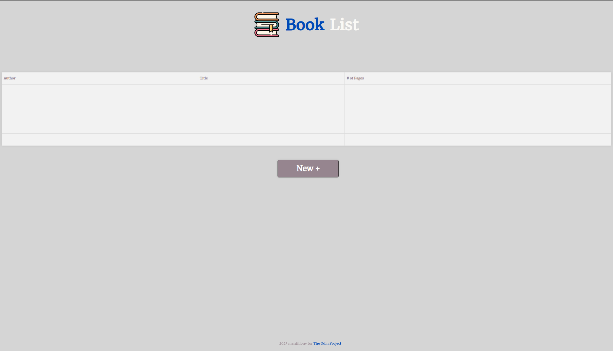

# library
TOP JavaScript Course Library with HTML, CSS And JS. 

"Let's extend the *Book* example from the previous lesson and turn it into a small **Library** app.

- Set up a HTML/CSS and JS skeleton.
- All book objects are to be stored in a simple array.
- Add function to script (bot constructor) that can take user's input and store the new book objects into the array.

<h2>Screenshot:</h2>
